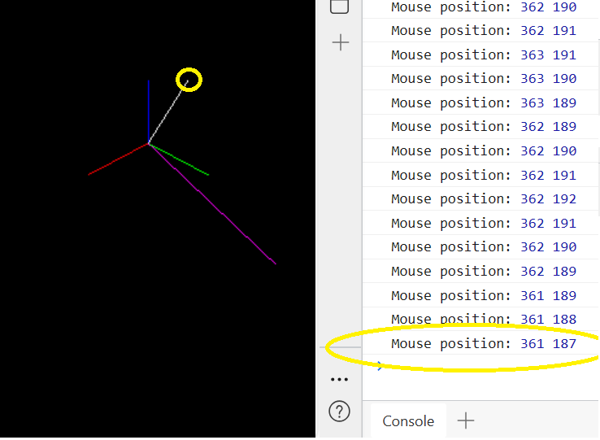

# LearnProjMatrix
这里的代码是配合[《OpenGL 投影矩阵设置》](https://zhuanlan.zhihu.com/p/636299906)以及[《OpenGL 投影矩阵与摄像机内参的关系（一）》](https://zhuanlan.zhihu.com/p/635801612) 在讲解投影矩阵时的测试代码。同时提供了projection.py方便大家进行图像坐标的验证。clone 所有代码，直接双击打开html文件即可看到渲染的图形。由于代码的目的是告诉大家一个3d点会被绘制到屏幕上的哪个位置，因此这些例子中都只包含最必要的代码。 \
用浏览器打开html文件后，按F12查看console的输出，将鼠标移至你要观察的点，可以看到console里会输出鼠标的位置，也就是当前点的图像坐标。 \
比如 z_negtive.html 中创建点P位于世界坐标系下的( 10, 15, 20)位置并将线段OP赋予白色，通过计算(注释部分)得到它应该在屏幕上的[361.18, 186.65]的位置。
```js
var P = new THREE.Vector3( 10, 15, 20); // 世界坐标系中的任意一点; [u, v] = [361.18, 186.65]
addVector(scene, O, P, 0xffffff);
```
打开z_negtive.html，F12查看console输出，将鼠标移至白色线段端点（如图黄圈处），从console输出可以看到当前鼠标位置也就是该点图像坐标为(361, 187)，表示渲染结果和咱们预想的一致。



