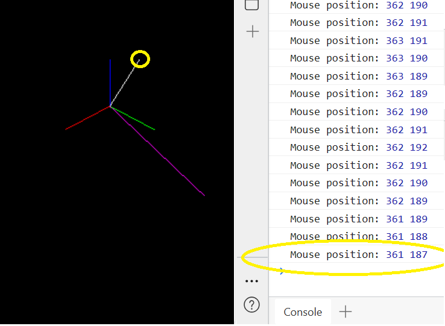
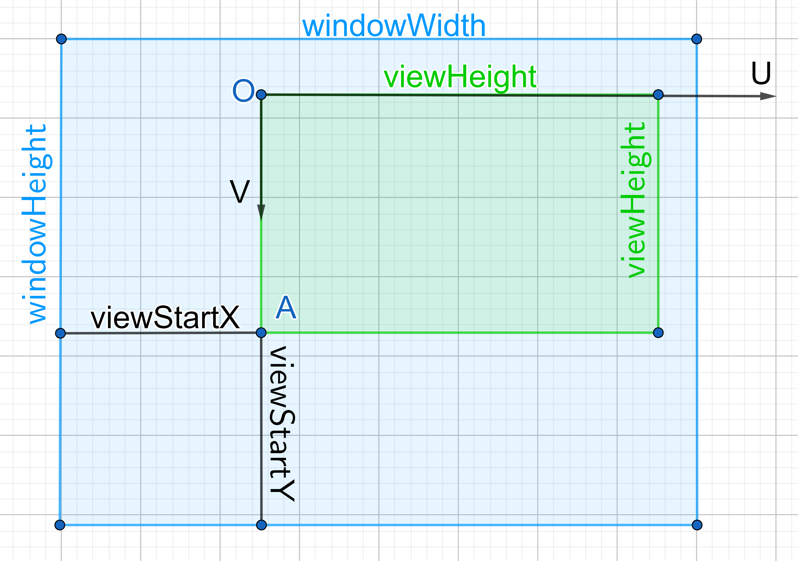
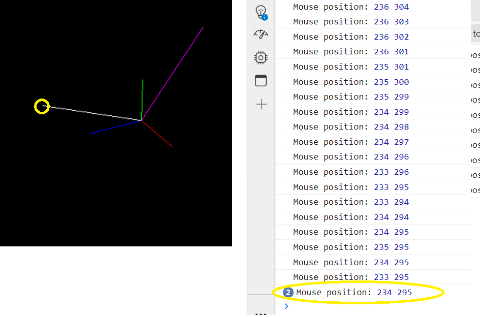

# LearnProjMatrix
You can also read [《OpenGL 投影矩阵设置》](https://zhuanlan.zhihu.com/p/636299906) and [《OpenGL 投影矩阵与摄像机内参的关系（一）》](https://zhuanlan.zhihu.com/p/635801612) for more details.\
[English version](https://github.com/bitlw/LearnProjMatrix/blob/main/doc/OpenGL_Projection.md) is also provided.


The code here are used for helping you to understand how OpenGL (Threejs) projection works. \
When we start to learn 3d reconstruction/Augmented Reality related area, we may learn many concepts include camera intrinsic matrix (K), rotation matrix (R), translation matrix/vector (t), etc. Then we know how to project a 3d point to an image by following formulation:
```math
\begin{pmatrix}
u \\ v \\ 1
\end{pmatrix} = K \cdot \left( R \cdot \begin{pmatrix} x \\ y \\ z \end{pmatrix} + t \right) / z_c
```
We may notice that OpenGL doesn't accept matrix K directly but a projection matrix P. So we need to know how to convert K to P. \
This repo contains some examples to help you understand how to convert K to P and verify the result. 

# Setup
Simply to clone this repo, double click the html file you want to view, that's it. \
For projection.py, it only depends on numpy, just do following command:
```
pip install numpy
```

# Details of usage
## z_negative.html
Take z_negative.html as an example, we create a point P at (10, 15, 20) in world coordinate system and assign white color to line OP. As we can see in the code, we also setup K and R/t:
```math
K = 
\begin{pmatrix}
-f_x & 0 & u_0 \\
0 & f_y & v_0 \\
0 & 0 & 1
\end{pmatrix} = 
\begin{pmatrix}
-565.5 & 0 & 328.2 \\
0 & 516.3 & 238.8 \\
0 & 0 & 1
\end{pmatrix}
```
```math
R = 
\begin{pmatrix}
-0.7071 & 0.7071 & 0 \\
-0.4083 & -0.4083 & 0.8165 \\
0.5774 & 0.5774 & 0.5774
\end{pmatrix}, \quad
t = 
\begin{pmatrix}
0 \\ 0 \\ -86.603
\end{pmatrix}
```

Then we calculate the image coordinate of P:
```math
\begin{pmatrix}
u \\ v \\ 1
\end{pmatrix} = K \cdot \left( R \cdot \begin{pmatrix} x \\ y \\ z \end{pmatrix} + t \right) / z_c = 
\begin{pmatrix}
361.18 \\ 186.65 \\ 1
\end{pmatrix}
```
Then double click z_negative.html, press F12 to open console, move your mouse to the white line segment, you will see the mouse position is (361, 187).\


## z_positive.html
You can do the same thing for z_positive.html.

## full_test.html and projection.py
full_test.html is more complex than z_negative.html and z_positive.html, its viewport is different from window size, and also the image resolution which is used for camera calibration is different from the viewport. \
So we should do:
1. Adjust K by a scale factor to make it suitable for the viewport.
2. Adjust image coordinate (u, v) by viewport offset.

The code in projection.py is used for verifying the result of full_test.html. \
Still take point P at (10, 15, 20) in world coordinate system as an example:
1. Setup the windows/viewport size.
```python
# window size which is the size of entire UI 
windowWidth = 640
windowHeight = 480

# viewport size which is the size of the area where we render the 3d scene
viewStartX = 40
viewStartY = 60
viewWidth = 580
viewHeight = 400
```
2. Calculate scale ratio for K based on the image resolution which is used for camera calibration and the window/viewport size.
```python
# image resolution which is used for camera calibration
calibrationWidth = 640
calibrationHeight = 480

ratioX = viewWidth / calibrationWidth
ratioY = viewHeight / calibrationHeight
fx = fx * ratioX # adjust all parameters in K by the relative ratio
fy = fy * ratioY
u0 = u0 * ratioX
v0 = v0 * ratioY
```
3. Calculate image coordinate (u, v) of P as what we did in z_negative.html and z_positive.html by updated K and R/t.

4. Adjust image coordinate (u, v) by viewport offset. Please note that OpenGL starts from left-bottom corner, but Threejs starts from left-top corner. The image below shows the case of OpenGL. For the case of Threejs, The (viewStartX, viewStartY) should be the distance between the left-top corner of the window and the left-top corner of the viewport (the point O). 
```python
if viewportThreeJS:
    v = q[1, 0] + viewStartY
else:
    v = q[1, 0] + (windowHeight - viewStartY - viewHeight)
```

5. After adjustment of (u, v), we can see final result is [u, v] = [233.42, 295.30]

Now let's look at full_test.html:
```javascript
var renderer = new THREE.WebGLRenderer();
renderer.setSize( windowWidth, windowHeight ); // the size of entire UI
// here (viewStartX, viewStartY) is the left-top corner of the viewport
renderer.setViewport(viewStartX, viewStartY, viewWidth, viewHeight); 
```
Run full_test.html, press F12 to open console, move your mouse to the white line segment, you will see the mouse position is [234, 295] which is consistent with the result of our calculation [u, v] = [233.42, 295.30].

