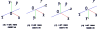

# Understand OpenGL projection matrix deeply
[Update:] Previously I only show the black background when I render virtual object, now I add a demo which can render virtual object on an image captured from real world, and all matrices are calculated from images rather than setup manually. Please see [real_world_demo](https://github.com/bitlw/LearnProjMatrix/tree/main/real_world_demo).

The code and documents here are used for helping you to fully understand how OpenGL (Threejs/glm/pyglet) projection matrix works. \
If you are learning 3d reconstruction (SFM, SLAM)/Augmented Reality, you will learn how to project a 3d point to a 2d screen by camera intrinsic matrix (K) and rotation (R) and translation (t) matrix. 

$$\begin{pmatrix}
u \\ 
v \\ 
1
\end{pmatrix} = K \cdot \left( R \cdot \begin{pmatrix} x \\ 
y \\ 
z \end{pmatrix} + t \right) / z_c$$

How can we verify if the calculation is correct or not? We can render 3d points (or 3d models) on the screen and then check where they are. \
Given a 3d point (x,y,z) and matrix K, R, t, we should be able to calculate its 2d coordinate (u, v); Then render it by OpenGL (or other engine), we can verify if its position on the screen equals to (u, v) or not.

We may notice that OpenGL doesn't accept matrix K directly but a projection matrix P. So we need to know how to convert K to P. I will show the formulation directly here, for more details about how to derive it, please read: [OpenGL_Projection.md](https://github.com/bitlw/LearnProjMatrix/blob/main/doc/OpenGL_Projection.md) or [《OpenGL 投影矩阵与摄像机内参的关系》](https://zhuanlan.zhihu.com/p/635801612) and [《OpenGL 投影矩阵设置》](https://zhuanlan.zhihu.com/p/636299906). 

The structure of this help is as following:
1. [Setup](#setup)
2. [How to convert K to P](#convert-k-to-p)
3. [Details of doc](#details-of-doc)
    1. [OpenGL_Projection.md](https://github.com/bitlw/LearnProjMatrix/blob/main/doc/OpenGL_Projection.md), I believe this doc answers many questions such as why we can see different coordinate setup in different documents? Where is the image plane? Can we customize NDC?
    2. [lookAt.md](https://github.com/bitlw/LearnProjMatrix/blob/main/doc/lookAt.md) shows how to convert result of lookAt to regular rotation (R) and translation (t) matrix.
    3. [NerfCoordinateDetails.md](https://github.com/bitlw/LearnProjMatrix/blob/main/doc/NerfCoordinateDetails.md) explains how to run our own data with NeRF, and it contains deeply analysis of the coordinate system used in NeRF especially when we are trying to use dataset_type='llff'.
4. [Details of usage of code](#details-of-usage)
    1. [z_negative.html](https://github.com/bitlw/LearnProjMatrix/blob/main/z_negative.html) and [z_positive.html](https://github.com/bitlw/LearnProjMatrix/blob/main/z_positive.html) are the simplest case. I hardcode K,R,t and provide several 3d points. You can calculate their 2d coordinates and check if their positions on the screen equal to your calculation.
    2. [full_test.html](https://github.com/bitlw/LearnProjMatrix/blob/main/full_test.html) is still simple enough (only a little bit complex than z_negative and z_positive), it contains different viewport and window size, and also the image resolution which is used for camera calibration is different from the viewport. It still only contains right hand coordinate system and hardcode rotation and translation matrix.
    3. [proj_lookat_demo.html](https://github.com/bitlw/LearnProjMatrix/blob/main/proj_lookat_demo.html) is a complete demo, it contains left hand coordinate system and rotation and translation matrix are calculated by lookat (see [lookAt.md](https://github.com/bitlw/LearnProjMatrix/blob/main/doc/lookAt.md)). I also provide  [projection.py](#projection.py) to help to calculate the 2d coordinates of all test points, but it's better if you can calculate them yourself.
    4. [glm_demo](https://github.com/bitlw/LearnProjMatrix/blob/main/glm_demo) is a C++ demo for OpengGL with glm. It contains the same setup as proj_lookat_demo.html.
    5. [pyglet_demo](https://github.com/bitlw/LearnProjMatrix/blob/main/pyglet_demo) is a python demo for OpengGL with pyglet. Please note that the y axis of mouse position is different (see comments in code)

# Setup
Simply to clone this repo, double click the html file you want to view, that's it. \
For projection.py, it only depends on numpy, just do following command:
```
pip install numpy
```
For glm_demo and pyglet_demo, please see readme.md under their folder.

# Convert K to P 
Firstly I will provide 4 formulas directly.

$$\begin{align}     
l &= &- u_0 \cdot near / f_x \nonumber \\     
r &=& (W - u_0) \cdot near / f_x \nonumber \\     
b &=& - (H - v_0) \cdot near / f_y \nonumber \\  
t &=& v_0 \cdot near / f_y \end{align} ..........................(1)$$

$$\begin{align}   
l &= &- u_0 \cdot near / f_x \nonumber \\   
r &=& (W - u_0) \cdot near / f_x \nonumber \\  
b &=&  (H - v_0) \cdot near / f_y   \nonumber \\  
t &=& - v_0 \cdot near / f_y \end{align}.............................(2)$$

You can see changes of $b$ and $t$ on (1) and (2). 

$$\begin{equation}
\begin{pmatrix}   
\frac{2 \cdot near}{r - l} & 0 & \frac{r+l}{r-l} & 0 \\  
0 & \frac{2 \cdot near}{t - b} & \frac{t+b}{t-b} & 0 \\    
0 & 0 & \frac{far + near}{near - far} & \frac{2 \cdot near \cdot far}{near - far} \\  
0 & 0 & -1 & 0    
\end{pmatrix}
\end{equation}..................(3)$$

$$\begin{equation}
\begin{pmatrix}   
\frac{2 \cdot near}{r - l} & 0 & -\frac{r+l}{r-l} & 0 \\  
0 & \frac{2 \cdot near}{t - b} & -\frac{t+b}{t-b} & 0 \\  
0 & 0 & -\frac{far + near}{near - far} & \frac{2 \cdot near \cdot far}{near - far} \\  
0 & 0 & 1 & 0     
\end{pmatrix}
\end{equation}..................(4)$$

The only difference between formulation (3) and (4) are the signs of the third column. 

<div align=center></div>
<div align=center>Figure 1</div>

Figure 1 shows four cases of camera coordinate system, which are right-hand (z negative), right-hand (z positive), left-hand (z positive) and left-hand (z negative). 

1. For right-hand (z negative), the camera intrinsic matrix K is as following and it's projection matrix P is combined by ***formulation (1) and (3)***(OpenGL default):

$$\begin{pmatrix}
-f_x & 0 & u_0 \\
0 & f_y & v_0 \\
0 & 0 & 1 
\end{pmatrix}$$

2. For right-hand (z positive), the camera intrinsic matrix K is as following and it's projection matrix P is combined by ***formulation (2) and (4)***(SFM/SLAM default):

$$\begin{pmatrix}
f_x & 0 & u_0 \\ 
0 & f_y & v_0 \\
0 & 0 & 1
\end{pmatrix}$$


3. For left-hand (z positive), the camera intrinsic matrix K is as following and it's projection matrix P is combined by ***formulation (1) and (4)***:

$$\begin{pmatrix}
f_x & 0 & u_0 \\ 
0 & -f_y & v_0 \\ 
0 & 0 & 1 
\end{pmatrix}$$

4. For left-hand (z negative), the camera intrinsic matrix K is as following and it's projection matrix P is combined by ***formulation (2) and (3)***:

$$\begin{pmatrix}
-f_x & 0 & u_0 \\ 
0 & -f_y & v_0 \\ 
0 & 0 & 1 
\end{pmatrix}$$

# Details of doc
Please look at [doc](https://github.com/bitlw/LearnProjMatrix/tree/main/doc) if you are interested in the formulations above and want to know where they come from.

# Details of usage
## z_negative.html
Take z_negative.html as an example, we create a point P at (10, 15, 20) in world coordinate system and assign white color to line OP. As we can see in the code, we also setup K and R/t:
```math
K = 
\begin{pmatrix}
-f_x & 0 & u_0 \\
0 & f_y & v_0 \\
0 & 0 & 1
\end{pmatrix} = 
\begin{pmatrix}
-565.5 & 0 & 328.2 \\
0 & 516.3 & 238.8 \\
0 & 0 & 1
\end{pmatrix}
```
```math
R = 
\begin{pmatrix}
-0.7071 & 0.7071 & 0 \\
-0.4083 & -0.4083 & 0.8165 \\
0.5774 & 0.5774 & 0.5774
\end{pmatrix}, \quad
t = 
\begin{pmatrix}
0 \\ 0 \\ -86.603
\end{pmatrix}
```

Then we calculate the image coordinate of P:
```math
\begin{pmatrix}
u \\ v \\ 1
\end{pmatrix} = K \cdot \left( R \cdot \begin{pmatrix} x \\ y \\ z \end{pmatrix} + t \right) / z_c = 
\begin{pmatrix}
361.18 \\ 186.65 \\ 1
\end{pmatrix}
```
Then double click z_negative.html, press F12 to open console, move your mouse to the white line segment, you will see the mouse position is (361, 187) which is very close to the calculation (361.18, 186.65).\


## z_positive.html
You can do the same thing for z_positive.html.

## full_test.html and projection.py
full_test.html is more complex than z_negative.html and z_positive.html, its viewport is different from window size, and also the image resolution which is used for camera calibration is different from the viewport. \
So we should do:
1. Adjust K by a scale factor to make it suitable for the viewport.
2. Adjust image coordinate (u, v) by viewport offset.

The code in projection.py is used for verifying the result of full_test.html. \
Still take point P at (10, 15, 20) in world coordinate system as an example:
1. Setup the windows/viewport size.
```python
# window size which is the size of entire UI 
windowWidth = 640
windowHeight = 480

# viewport size which is the size of the area where we render the 3d scene
viewStartX = 40
viewStartY = 60
viewWidth = 580
viewHeight = 400
```
2. Calculate scale ratio for K based on the image resolution which is used for camera calibration and the window/viewport size.
```python
# image resolution which is used for camera calibration
calibrationWidth = 640
calibrationHeight = 480

ratioX = viewWidth / calibrationWidth
ratioY = viewHeight / calibrationHeight
fx = fx * ratioX # adjust all parameters in K by the relative ratio
fy = fy * ratioY
u0 = u0 * ratioX
v0 = v0 * ratioY
```
3. Calculate image coordinate (u, v) of P as what we did in z_negative.html and z_positive.html by updated K and R/t.

4. Adjust image coordinate (u, v) by viewport offset. Please note that OpenGL starts from left-bottom corner, but Threejs starts from left-top corner. The image below shows the case of OpenGL. For the case of Threejs, The (viewStartX, viewStartY) should be the distance between the left-top corner of the window and the left-top corner of the viewport (the point O). 
```python
if viewportThreeJS:
    v = q[1, 0] + viewStartY
else:
    v = q[1, 0] + (windowHeight - viewStartY - viewHeight)
```

5. After adjustment of (u, v), we can see final result is [u, v] = [233.42, 295.30]

Now let's look at full_test.html:
```javascript
var renderer = new THREE.WebGLRenderer();
renderer.setSize( windowWidth, windowHeight ); // the size of entire UI
// here (viewStartX, viewStartY) is the left-top corner of the viewport
renderer.setViewport(viewStartX, viewStartY, viewWidth, viewHeight); 
```
Run full_test.html, press F12 to open console, move your mouse to the white line segment, you will see the mouse position is [234, 295] which is consistent with the result of our calculation [u, v] = [233.42, 295.30].

