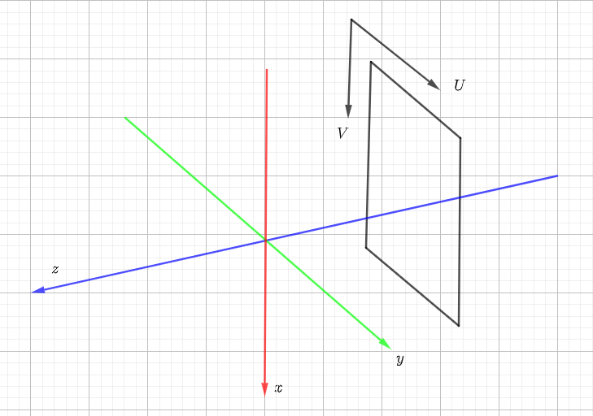

# Coordinate System Explanation in NeRF

In this document I focus on analysis of coordinate system used in NeRF. I will explain how to prepare your own camera pose data when you want to run the NeRF code with your data. Here will take the [pytorch version](https://github.com/yenchenlin/nerf-pytorch/tree/master) as an example (the coordinate configuration is as same as the [original tensorflow version](https://github.com/bmild/nerf)). \  
Firstly I will give the conclusion; then explain details (case 2 is more interesting and worth analyzing).

## case 1: get camera pose from colmap and then run run_nerf.py with dataset_type='blender'.
Suppose the output of colmap is R/t, the you should do following transformation to get the camera pose used in NeRF:
$$T=\begin{pmatrix}
1 & 0 & 0 & 0 \\
0 & -1 & 0 & 0 \\
0 & 0 & -1 & 0 \\
0 & 0 & 0 & 1
\end{pmatrix}  \cdot \begin{pmatrix}
R & t \\
0_{1 \times 3} & 1
\end{pmatrix}$$
Then calculate inverse matrix of T, extract R and t from $T^{-1}$ and save them. Then you can read them in run_nerf.py with dataset_type='blender'.

## case 2: using imgs2poses.py which is provided by [LLFF](https://github.com/Fyusion/LLFF/tree/master) to prepare camera pose and then run run_nerf.py with dataset_type='llff'.
In this case there is no additional transformation needed. You can read the camera pose directly in run_nerf.py with dataset_type='llff'.

## Details
### In case 1 (dataset_type='blender'), why do we need to do the transformation? 
Let's look at the description of [original tensorflow version](https://github.com/bmild/nerf): 
> In run_nerf.py and all other code, we use **the same pose coordinate system as in OpenGL**: the local camera coordinate system of an image is defined in a way that the **X axis points to the right, the Y axis upwards, and the Z axis backwards** as seen from the image.

As the description above we understand the coordinate system used in NeRF is right-hand system, z negative direction (OpenGL default). As I said in [OpenGL_Projection.md](https://github.com/bitlw/LearnProjMatrix/blob/main/doc/OpenGL_Projection.md), the camera intrinsic matrix K is:
$$K=\begin{pmatrix}
-f_x & 0 & 0 \\
0 & f_y & 0 \\
0 & 0 & 1
\end{pmatrix}$$
So if there is a point in 3d space, its camera coordinate is $(x_c, y_c, z_c)$ and its image coordinates is (u,v), then we have:
$$\begin{pmatrix}
u \\
v \\
1
\end{pmatrix} = K \cdot \begin{pmatrix}
x_c/z_c \\
y_c/z_c \\
1
\end{pmatrix} => 
\begin{cases}
x_c/z_c = -(u - u_0) /f_x \\
y_c/z_c = (v - v_0) /f_y 
\end{cases}$$
And because we look at the negative direction of z, so we can assume $z_c = -1$, then we have:
$$\begin{cases}
x_c = (u - u_0) /f_x \\
y_c = -(v - v_0) /f_y \\
z_c = -1
\end{cases}$$
That's the reason why you can see the following code in function get_rays() in file run_nerf.py :
```python
dirs = torch.stack([(i-K[0][2])/K[0][0], -(j-K[1][2])/K[1][1], -torch.ones_like(i)], -1)
# please note that here i is u, j is v.
```

Then let's answer "why do we need to do the transformation". Becase the output of colmap is right-hand system, z positive direction (SFM/SLAM default), which is different from OpenGL default congiguration. So we need to do the transformation to make the coordinate system of camera pose output by colmap is the same as the coordinate system used in NeRF. \
In case 1, I directly provide:
$$\begin{pmatrix}
1 & 0 & 0 & 0 \\
0 & -1 & 0 & 0 \\
0 & 0 & -1 & 0 \\
0 & 0 & 0 & 1
\end{pmatrix}$$
You can refer to formulation (2) in [lookAt.md](https://github.com/bitlw/LearnProjMatrix/blob/main/doc/lookAt.md) to understand how to calculate this matrix. \

### In case 2 (dataset_type='llff'), I will explain more even there is no additional transformation needed.
Let's look at the descriptions in LLFF:
> The right-handed coordinate system of the the rotation (first 3x3 block in the camera-to-world transform) is as follows: from the point of view of the camera, **the three axes are[down, right, backwards]** which some people might consider to be[-y,x,z], where the camera is looking along-z. (The more conventional frame [x,y,z] is [right, up, backwards]. The COLMAP frame is [right, down, forwards] or [x,-y,-z].)

<div align=center></div>
<div align=center>Figure 1 [x down, y right, z backwards]</div>

As I said in [OpenGL_Projection.md](https://github.com/bitlw/LearnProjMatrix/blob/main/doc/OpenGL_Projection.md), you can define any coordinate system you want, but you need to make sure that the coordinate system you define is consistent with the coordinate system used in your rendering system. \
LLFF uses the coordinate system shown in Figure 1, but they actually use colmap to prepare camera pose, so they should apply following transformation on colmap output:

$$T_{colmap-to-LLFF}=\begin{pmatrix}
0 & 1 & 0 & 0 \\
1 & 0 & 0 & 0 \\
0 & 0 & -1 & 0 \\
0 & 0 & 0 & 1
\end{pmatrix}$$

That's why you can see following code when LLFF is trying to save camera pose (in function load_colmap_data in file [pose_utils.py](https://github.com/Fyusion/LLFF/blob/master/llff/poses/pose_utils.py)):
```python
# must switch to [-u, r, -t] from [r, -u, t], NOT [r, u, -t]
poses = np.concatenate([poses[:, 1:2, :], poses[:, 0:1, :], -poses[:, 2:3, :], poses[:, 3:4, :], poses[:, 4:5, :]], 1)
```
You can see author swaps the first and the second column, and the third column is multiplied by -1. The reason is $T_{colmap-to-LLFF}$ is applied on colmap result (you can try to calculate the result to verify it). \

Til now, imgs2poses.py can save the camera pose under the coordinate system in Figure 1. But when we load the camera pose in run_nerf.py, we need to convert to OpenGL default coordinate system which is used in function get_rays() by:
$$T_{LLFF-to-OpenGL}=\begin{pmatrix}
0 & 1 & 0 & 0 \\
-1 & 0 & 0 & 0 \\
0 & 0 & 1 & 0 \\
0 & 0 & 0 & 1
\end{pmatrix}$$

So if you pass dataset_type='llff' to run_nerf.py, you can see there is another transformation applied in function load_llff_data():

```python
poses = np.concatenate([poses[:, 1:2, :], -poses[:, 0:1, :], poses[:, 2:, :]], 1)
```
You can see the first column is multiplied by -1 and is moved to second column, and the original second column is moved to the first, there is no changes of the third column. This is the result of $T_{LLFF-to-OpenGL}$ applied on the camera pose saved by imgs2poses.py. \

## Summary
If you want to use your own data to run NeRF, you can choose case 1 or case 2. But if you want to use colmap result directly, then you need to modify function get_rays():
```python
# dirs = torch.stack([(i-K[0][2])/K[0][0], -(j-K[1][2])/K[1][1], -torch.ones_like(i)], -1)
# please comment out original code (above), and use the code below: i and j are both positive and the last column should be 1 rather than -1
dirs = torch.stack([(i-K[0][2])/K[0][0], (j-K[1][2])/K[1][1], torch.ones_like(i)], -1)