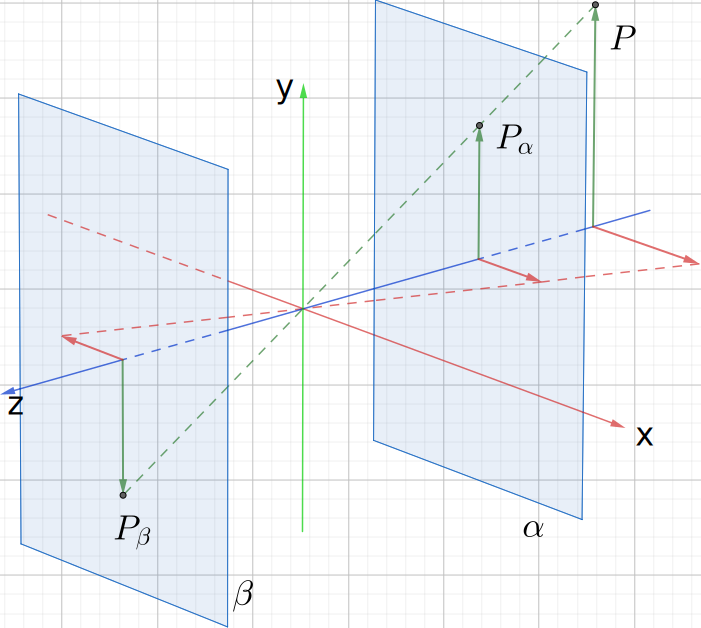
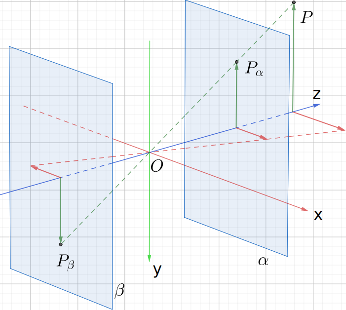
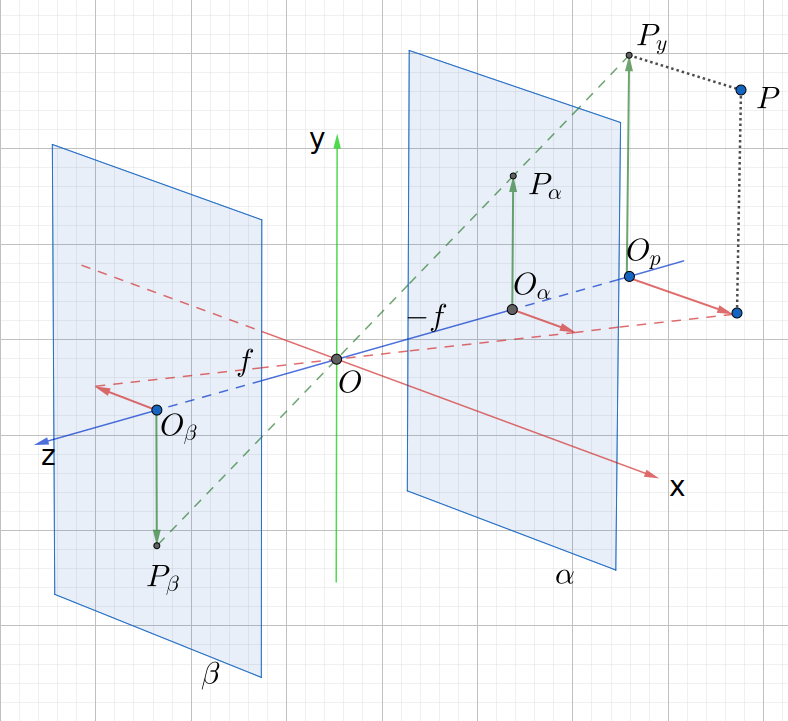
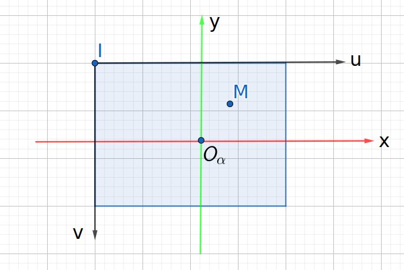
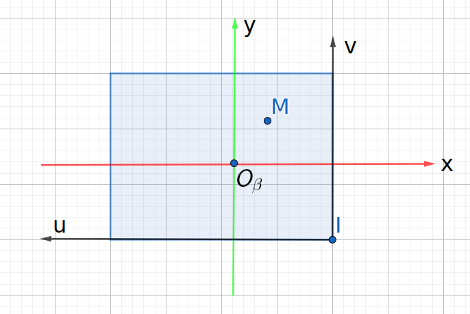
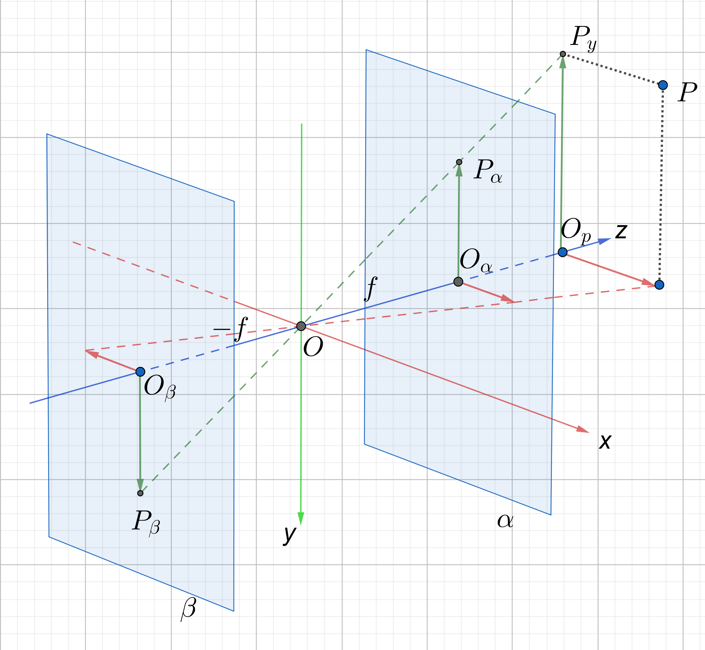
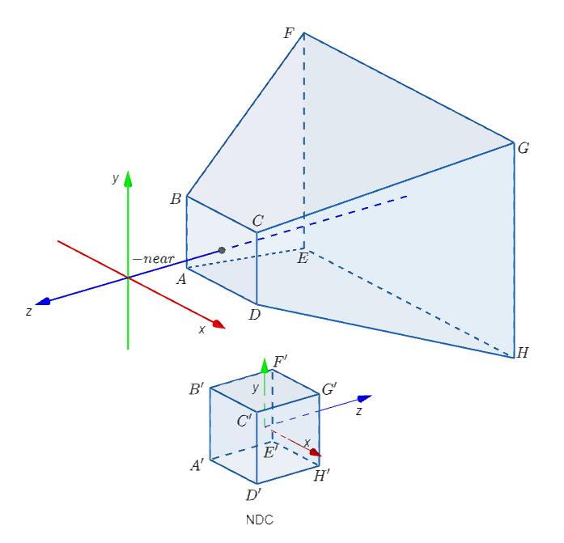
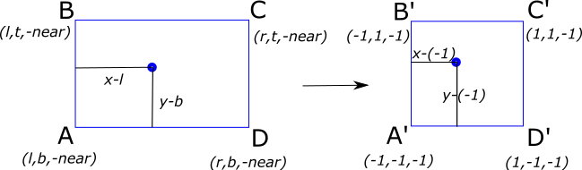
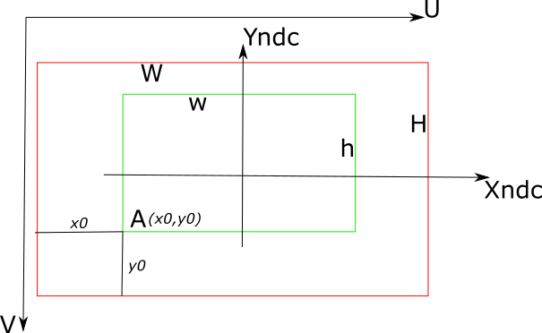
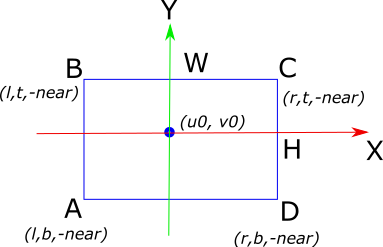

# How to convert camera intrinsic matrix to OpenGL projection matrix

 We focus on several important questions here:
 1. What is the correct orientation of the coordinate system when we calculate projection matrix?
 2. Where is the image plane? in front of the camera or behind the camera?
 3. Why is NDC a left-handed coordinate system? Can I customize NDC?
 
 ## Introduction
 When we are trying to learn OpenGL or 3d reconstruction, the introductory textbook usually starts with the pinhole model. In general, OpenGL textbook will give the coordinate system shown in Figure 1(A), and then deduce the projection matrix (usually using the function gluPerspective or glFrustum); while the 3d reconstruction (SFM, SLAM) textbook is very likely to be the camera shown in Figure 1(B).
 

 We may notice there is a significant difference between Figure 1(A) and (B): the Z-axis of the camera coordinate system is reversed, and the direction of the Y-axis has also changed, because we use the right-hand coordinate system (the left-hand coordinate system will be introduced later). If you are learning OpenGL and 3D reconstruction at the same time, you will have the first question when you see here: should the observation direction be the positive or negative direction of z? Before the first question is solved, the textbook will then derive the formula based on the image plane $\alpha$  in Figure 1. At this time, you would have the second question: the actual pinhole model image plane should be behind the camera, that is, the plane $\beta$, why should we calculate according to the plane $\alpha$? Of course, some literature mentions that these two are the same, but only gives this conclusion, and does not give a reason to directly carry out the subsequent derivation.
 | 
---|---
| 
Figure 1 (A)
 | 
Figure 1 (B)
 |

Then we have two questions at the beginning:
1. What is the correct orientation of the coordinate system when we calculate projection matrix? Figure 1 (A) or (B)?
2. Where is the image plane? in front of the camera ($\alpha$) or behind the camera ($\beta$)?

Let's answer the two questions:
1. Either (A) or (B) can be set, and you can even have more settings, such as the left-hand coordinate system mentioned later, such as letting the x-axis be vertical downward, the y-axis to the right, and the z-axis facing behind. The problem is that after the derivation is completed, you must be clear about what your setting is when using (3D reconstruction or rendering) to ensure that no errors occur.
2. The image plane can be either in front or behind, because the results derived are the same. 
Let me provide more details and show how to verify the conclusion just made.

## 1. The pinhole model--z negative direction (Figure 1A)
### 1.1 The derivation on image $\alpha$

Figure 2

Considering the component $P_{y} (y_c)$ of the point $P(x_c, y_c, z_c)$ in space on the $y$ axis, its projection on the two planes are $P_{\alpha}$ and $P_{\beta}$ respectively, as shown in Figure 2. It can be seen from the simple geometric relationship that:
$$\begin{equation} 
    \frac{|P_y O_p|}{|O_p O|} = \frac{|P_{\alpha} O_{\alpha}|}{|O_{\alpha} O|}
\end{equation}$$

Since the plane $\alpha$ is in the negative half axis of $z$, the focal length is represented by $f$ (the symbol is positive), then $O_{\alpha} O = -f$; let $y_p$ denote the coordinate y of $P_{\alpha}$, then we have:
$$\begin{equation}
    \frac{y_c}{z_c} = \frac{y_p}{-f} => y_p = - f \cdot \frac{y_c}{z_c}
\end{equation}$$
We do the same analysis of the projection on $x$:
$$\begin{equation}
    \frac{x_c}{z_c} = \frac{x_p}{-f} => x_p = - f \cdot \frac{x_c}{z_c}
\end{equation}$$

Then we consider how to convert the projection coordinates $(x_p, y_p, -f)$ on the image plane $\alpha$ into image (pixel) coordinates. The image we see from screen is an upright image, and the image on the image plane $\alpha$ is also upright, so there is no need to process it specially. Let's look at the image plane $\alpha$ in Figure 3.\
***Note that the orientation of the $x$ and $y$ axes here cannot be drawn arbitrarily, but must be consistent with the $x$ and $y$ axes of the camera coordinate system.*** You will notice that they will be different when analyzing the observation direction in the positive direction of the $z$ axis in Figure 1 (B).

Figure 3

Suppose the pixel coordinates of the point $O_{\alpha}$ on the image plane $\alpha$ are $(u_0, v_0)$, and the length of each pixel in the $x$ direction is $\delta x$, and the length in the $y$ direction is $\delta y$. Then the pixel coordinates of any point $M(x_p, y_p, -f)$ are:
$$\begin{equation}
\begin{cases}
(u - u_0) \cdot \delta x = x_p \\
(v_0 - v) \cdot \delta y = y_p
\end{cases}
\end{equation}$$

By substituting equations 2 and 3 into equation 4, we get:

$$\begin{equation}
    \begin{cases}
    u = - \frac{f}{\delta x} \cdot \frac{x_c}{z_c} + u_0 \\
    v = \frac{f}{\delta y} \cdot \frac{y_c}{z_c} + v_0 \\
    \end{cases}
\end{equation}$$

Let $f_x = f / \delta x$，$f_y = f / \delta y$，we have：
$$\begin{equation}
    \begin{pmatrix}
    u \\ v \\ 1
    \end{pmatrix} = 
    K \cdot 
    \begin{pmatrix}
    x_c / z_c \\
    y_c / z_c \\
    1
    \end{pmatrix}
    =
    \begin{pmatrix}
    -f_x & 0 & u_0 \\
    0 & f_y & v_0 \\
    0 & 0 & 1
    \end{pmatrix} \cdot 
    \begin{pmatrix}
    x_c / z_c \\
    y_c / z_c \\
    1
    \end{pmatrix}
\end{equation}$$

Note that there is a negative sign on the first term $f_x$ of the $K$ matrix here, while the $K$ matrix commonly used in 3D reconstruction does not have this negative sign. \
Next, let's take a look at the analysis of Figure 1 (B) in order to answer the second question raised at the beginning: "Why can we calculate projection matrix according to the plane $\alpha$ instead of the plane $\beta$?"

### 1.2 The derivation on image $\beta$
Comparing to analysis on image $\alpha$, the only difference is that the projection coordinates on the image plane are no longer $(x_p, y_p, -f)$, but $(x_p, y_p, f)$. Therefore, we can get:
$$\begin{equation}
\begin{cases}
    \frac{x_c}{z_c} = \frac{x_p}{f} => x_p = f \cdot \frac{x_c}{z_c} \\
    \frac{y_c}{z_c} = \frac{y_p}{f} => y_p = f \cdot \frac{y_c}{z_c}
\end{cases}
\end{equation}$$

Since the $\beta$ plane is an inverted image, the CCD will automatically rotate the image to the positive image when imaging, so pay attention to the orientation of the UV axis when analyzing the coordinates on this plane:

Figure 4

The we get:

$$\begin{equation}
\begin{cases}
(u_0 - u) \cdot \delta x = x_p \\
(v - v_0) \cdot \delta y = y_p
\end{cases}
\end{equation}$$

$$\begin{equation}
    \begin{cases}
    u = - \frac{f}{\delta x} \cdot \frac{x_c}{z_c} + u_0 \\
    v = \frac{f}{\delta y} \cdot \frac{y_c}{z_c} + v_0 \\
    \end{cases}
\end{equation}$$

The result is completely consistent with equation 5, so the K matrix derived on the image plane $\beta$ is still:
$$\begin{equation}
    K = 
    \begin{pmatrix}
    -f_x & 0 & u_0 \\
    0 & f_y & v_0 \\
    0 & 0 & 1
    \end{pmatrix}
\end{equation}$$

***So whether the image plane is in front or behind does not affect the final result, which is why many literatures directly calculate K according to the image plane in front.*** At the same time, for the case where the camera is facing the negative direction of the $z$ axis (OpenGL default setting), the first item of the camera intrinsic matrix $K$ derived is negative.

Now let's derive K  based on the camera observation direction is the positive direction of the $z$ axis (Figure 1 (B)) (the first item of the camera intrinsic matrix $K$ is positive). Since it is already known that the position of the image plane does not affect the result, the derivation is only based on the plane $\alpha$.

## 2. The pinhole model--z positive direction (Figure 1B, plane $\alpha$)

Figure 5

Similar to analysis of z negative direction, according to figure 5, we can get:

$$ \begin{equation}      \frac{|P_y O_p|}{|O_p O|} = \frac{|P_{\alpha} O_{\alpha}|}{|O_{\alpha} O|} \end{equation} $$

And we have $O_{\alpha}O=f$, then:

$$ \begin{equation}     \frac{y_c}{z_c} = \frac{y_p}{f} => y_p =  f \cdot \frac{y_c}{z_c} \end{equation} $$
$$ \begin{equation}     \frac{x_c}{z_c} = \frac{x_p}{f} => x_p = f \cdot \frac{x_c}{z_c} \end{equation} $$

The next derivation is similar to equations (4) and (5), but there is a very important thing, that is, what is the direction of the coordinate axis on the plane $\alpha$ when mapping $P_{\alpha}$ to the image coordinate, which is the "***note that the orientation of the x and y axes here cannot be drawn arbitrarily, but must be consistent with the x and y axes of the camera coordinate system***" I mentioned previously, as shown in Figure 6:

Figure 6

Similarly, Figure 6 is essentially the plane $\alpha$ when looking at the positive direction of z from point O in Figure 5, so the x and y axes follow the direction of these two axes in Figure 5, especially pay attention to the y axis downward.

Then we get:

$$ \begin{equation} \begin{cases} (u - u_0) \cdot \delta x = x_p \\ (v_0 - v) \cdot \delta y = -y_p \text{\quad Pay attention, we got changes here!} \end{cases} \end{equation}  $$

$$ \begin{equation}     \begin{cases}     u =  \frac{f}{\delta x} \cdot \frac{x_c}{z_c} + u_0 \\     v = \frac{f}{\delta y} \cdot \frac{y_c}{z_c} + v_0 \text{\quad \quad \quad \quad \quad \quad \quad \quad \quad \quad \quad \quad \quad \quad \quad \quad \quad \quad}\\     \end{cases} \end{equation} $$
$$ \begin{equation}     \begin{pmatrix}     u \\ v \\ 1     \end{pmatrix} =      K \cdot      \begin{pmatrix}     x_c / z_c \\     y_c / z_c \\     1     \end{pmatrix}     =     \begin{pmatrix}     f_x & 0 & u_0 \\     0 & f_y & v_0 \\     0 & 0 & 1     \end{pmatrix} \cdot      \begin{pmatrix}     x_c / z_c \\     y_c / z_c \\     1     \end{pmatrix} \end{equation} $$

As you can see, all coefficients of matrix K are positive, which is the common form that everyone often sees in 3D reconstruction.

We discuss the difference of K caused by different z-axis orientations, and also explain that the position of the image plane in front or behind does not affect the final K result. Actually, you can continue to rotate the x and y axes around the z axis as you wish, so you can create another different form of K than the one discussed in these two sections, and those results are also correct. But as mentioned earlier, you need to remember how you setup your camera coordinate system when you use it.\
Different coordinate system settings will result in different K matrices, and therefore different projection matrices; and all of them are correct if you can convert your own K to projection matrix which is required by rendering engine. It is not that the z axis must be forward or backward; it is not that only the left-handed system or the right-handed system can be used. The following sections will explain how to convert this K matrix into the projection matrix required for rendering in OpenGL.

## 3. Convert K to projection matrix
This process is also related to the orientation of z, so it is still divided into two sections for discussion. Songho provided a good [reading material](http://www.songho.ca/opengl/gl_projectionmatrix.html) for this calculation based on OpenGL default setting, which is that the orientation of camera is the negative direction of z.

### 3.1. z negative direction (Figure 1A)

Figure 7

In figure 7, the plane ABCD (which is the image plane $\alpha$ in Figure 1 (A)) will eventually be mapped to the image we actually see on screen (such as an image with width w and height h). The projection calculation process is essentially no different from the previous derivation of K, but obviously there will be infinite points in the frustum ABCD-EFGH that will be projected to the same point on the plane ABCD (for example, any point on the line BF will be projected to point B), so when rendering, not only the calculation of 2d coordinates must be correct, but also the occlusion relationship must be handled correctly, that is, a reasonable depth coordinate z must be retained while projection. This is why OpenGL's approach is to map all points in the frustum ABCD-EFGH to the NDC coordinate system below.\
Plane ABCD is the near clipping plane, and the z coordinate of all points on this plane is $-near$. So the coordinates of the conners ABCD in the camera coordinate system can be written as:
$$A(l,b,-near), B(l,t,-near),C(r,t,-near), D(r,b,-near)$$
where $l$,$r$,$t$,$b$ are the left/right/top/bottom coordinate of the near clipping plane. And EFGH is the far clipping plane (z = -far). \
NDC's 8 vertices correspond to the 8 vertices of the frustum in the camera coordinate system one by one, and NDC is a cube with a side length of 2 (each coordinate component is 1 or -1):
$$A'(-1,-1,-1),B'(-1,1,-1),C'(1,1,-1),D'(1, -1,-1)$$
$$E'(-1,-1,1),F'(-1,1,1),G'(1,1,1),H'(1, -1,1)$$

You may notice that NDC is a left-handed coordinate system. In fact, there is no special meaning here, just because we want: on the plane A'B'C'D', A'B' means "left" as the same way as AB on the image plane ABCD, and C'D' means the "right"; and we also want A'B'C'D' to be the "near" clipping plane, and E'F'G'H' is the "far" clipping plane. So NDC becomes a left-handed coordinate system. We may ask:
1. Can I use a right-handed coordinate system?
2. Can I use a cuboid such as $A'(-2,-1,-1),B'(-2,1,-1),C'(2,1,-1),D'(2, -1,-1)$?

Actually the question is that: can we use self-define NDC coordinate system. If you use OpenGL as rendering engine, the answer is "no", you cannot modify NDC in any way. Because the process of projecting a point from the camera coordinate system to the screen is: camera coordinate $(x_c, y_c, z_c)$ -> projection coordinate $(x_p, y_p, z_p)$ on the image plane ABCD (plane $\alpha$) -> clip coordinate (NDC coordinate) -> image coordinate on screen. The last step from NDC to image coordinate is completed by glViewport. And this function is an internal function and cannot be override. What this function does is to convert its own defined NDC coordinate into image coordinate on screen, so you cannot modify this definition unless you write rendering engine yourself.\
By the way, the clip coordinate is not the NDC coordinate. To explain this, we need to mention the concept of homogeneous coordinates. Homogeneous coordinates is to add one dimension to the original coordinate:
$$(x,y,z) \rightarrow (x,y,z,w)$$
The w component is called the homogeneous coordinate. The homogeneous coordinate is not unique, because $(x,y,z,w)$ and $(\lambda x, \lambda y, \lambda z, \lambda w)$ represent the same point. So we usually use the normalized homogeneous coordinate, that is, the w component is 1. So the clip coordinate is actually the normalized homogeneous coordinate.\
$$(x_{clip} / w_{clip}, y_{clip} / w_{clip}, z_{clip} / w_{clip}) = (x_{ndc}, y_{ndc}, z_{ndc})$$
Why do we need to add one dimension? Because we want to use matrix to represent the projection process, and the projection process is essentially a linear transformation. The projection matrix is a 4x4 matrix, and the coordinate is a 4x1 vector. So we need to add one dimension to the original coordinate to make it a 4x1 vector.\
Previously we use:
$$\begin{pmatrix} x' \\ y' \\ z' \end{pmatrix} = R \cdot \begin{pmatrix} x \\ y \\ z  \end{pmatrix} + t$$
Now we can use:
$$\begin{pmatrix} x' \\ y' \\ z' \\ w' \end{pmatrix} =  \begin{pmatrix} R_{3\times 3} & t_{3 \times 1}\\ 0_{1 \times 3} & 1 \end{pmatrix} _{4 \times 4}  \cdot \begin{pmatrix} x \\ y \\ z \\ 1 \end{pmatrix} $$

Now let's start to calculate projection matrix.
Formulation (2) and (3) above represent the coordinates of a point from the camera coordinate system (subscript c) projected onto the plane ABCD (subscript p):
$$\begin{equation}     \begin{cases}     x_p = near \cdot \frac{x_c}{-z_c} \\     y_p = near \cdot \frac{y_c}{-z_c}     \end{cases} \end{equation}$$

Because plane ABCD will map to plane A'B'C'D' (NDC), see figure8,

Figure 8

we can write:

$$\begin{eqnarray}     \frac{x_p - l}{r - l} = \frac{x_{NDC} - (-1)}{1 - (-1)} \nonumber \\     \Rightarrow x_{NDC} = \frac{2(x_p - l)}{r-l} - 1 \nonumber \\     \Rightarrow x_{NDC} = \frac{2x_p}{r - l} - \frac{r + l}{r - 1} \end{eqnarray}$$
where:
$$ \begin{equation}     \begin{cases}     x_p = near \cdot \frac{x_c}{-z_c} \\     y_p = near \cdot \frac{y_c}{-z_c}     \end{cases} \end{equation}$$
Then :
$$\begin{eqnarray}     x_{NDC} &=& \frac{2x_p}{r - l} - \frac{r + l}{r - 1} \nonumber \\     &=& \frac{2 \cdot near \cdot \frac{x_c}{-z_c}}{r - l} - \frac{r + l}{r - 1} \nonumber \\     &=& \frac{\frac{2 \cdot near}{r - l} \cdot x_c}{-z_c}  + \frac{\frac{r + l}{r - 1} \cdot z_c}{-z_c}  \end{eqnarray}$$

As we can see, the denominator is $-z_c$, and $x_{NDC}=x_{clip} / w_{clip}$. Since the w component of the homogeneous coordinate can be set arbitrarily without changing the position of the point in space, we can take $w_{clip}=-z_c$. Then we get:
$$\begin{equation}     x_{clip} = \frac{2 \cdot near}{r - l} \cdot x_c + \frac{r + l}{r - 1} \cdot z_c ，w_{clip}=-z_c \end{equation}$$
Then we get the first row and the last row of the projection matrix:
$$\begin{equation}     \begin{pmatrix}     x_{clip} \\ y_{clip} \\ z_{clip} \\ w_{clip}     \end{pmatrix}     = \begin{pmatrix}     \frac{2 \cdot near}{r - l} & 0 & \frac{r+l}{r-l} & 0 \\     . & . & . & . \\     . & . & . & . \\     0 & 0 & -1 & 0     \end{pmatrix}     \cdot      \begin{pmatrix}     x_c \\ y _c \\ z_c \\ w_c     \end{pmatrix} \end{equation}$$
We can do the same for the y coordinate:
$$\begin{eqnarray}     \frac{y_p - b}{t - b} = \frac{y_{NDC} - (-1)}{1 - (-1)} \nonumber \\     \Rightarrow y_{NDC} = \frac{2(y_p - b)}{t-b} - 1 \nonumber \\     \Rightarrow y_{NDC} = \frac{2y_p}{t - b} - \frac{t + b}{t - b} \end{eqnarray} $$
Where:
$$ \begin{equation}     \begin{cases}     x_p = near \cdot \frac{x_c}{-z_c} \\     y_p = near \cdot \frac{y_c}{-z_c}     \end{cases} \end{equation}$$
Then:
$$\begin{eqnarray}     y_{NDC} &=& \frac{2y_p}{t - b} - \frac{t + b}{t - b} \nonumber \\     &=& \frac{2 \cdot near \cdot \frac{y_c}{-z_c}}{t - b} - \frac{t + b}{t - b} \nonumber \\     &=& \frac{\frac{2 \cdot near}{t - b} \cdot y_c}{-z_c}  + \frac{\frac{t + b}{t - b} \cdot z_c}{-z_c}  \end{eqnarray}$$
Then we have:
$$\begin{pmatrix}     x_{clip} \\ y_{clip} \\ z_{clip} \\ w_{clip}     \end{pmatrix}     = \begin{pmatrix}     \frac{2 \cdot near}{r - l} & 0 & \frac{r+l}{r-l} & 0 \\     0 & \frac{2 \cdot near}{t - b} & \frac{t+b}{t-b} & 0 \\     . & . & . & . \\     0 & 0 & -1 & 0     \end{pmatrix}     \cdot      \begin{pmatrix}     x_c \\ y _c \\ z_c \\ w_c     \end{pmatrix}$$

The third row of the projection matrix can be any value if we just want to calculate 2d position. But as mentioned earlier, the rendering engine needs to deal with occlusion. Points closer to the camera obviously occlude points farther away. So we have to map z from clip frustum to NDC as well. Then $z_{clip}=T_{31} \cdot x_c + T_{32} \cdot y_c + T_{33} \cdot z_c + T_{34} \cdot w_c$ must satisfy the following properties:
1. $z_{clip}$ should be a monotone increasing function of $z_c$.
2. $z_{clip} |_{z_c = -near} = -1$
3. $z_{clip} |_{z_c = -far} = 1$
4. $T_{31}=T_{32}=0$, Songho also mentioned that.

Now let $w_c = 1$ since it can be set arbitrarily.
Mapping from camera coordinate system to NDC is just a numerical mapping that does not change the occlusion relationship. For those points which has the same z in clip frustum, their new z in NDC should be the same as well.
$$T_{31} \cdot x_{c1} + T_{32} \cdot y_{c1} + T_{33} \cdot z_c + T_{34} =T_{31} \cdot x_{c2} + T_{32} \cdot y_{c2} + T_{33} \cdot z_c + T_{34}  \\
\Rightarrow T_{31} \cdot x_{c1} + T_{32} \cdot y_{c1} =T_{31} \cdot x_{c2} + T_{32} \cdot y_{c2} $$
Since x and y can be any value, we have: $T_{31}=T_{32}=0$. Then let $T_{33}=A,T_{34}=B$:
$$z_{NDC} = \frac{z_{clip}}{w_{clip}} = \frac{A \cdot z_c + B }{-z_c}$$
According to the second and third properties, we have:
$$\begin{equation}     \begin{cases}     \frac{-A \cdot near + B}{near} = -1 \\     \frac{-A \cdot far + B}{far} = 1     \end{cases} \end{equation} $$
$$\begin{equation}     \begin{cases}     A = \frac{far + near}{near - far} \\     B = \frac{2 \cdot near \cdot far}{near - far}     \end{cases} \end{equation} $$
We can see that A < 0 and B < 0.
So $z_{NDC}$ is an inverse proportional function of $(-z_c)$ and the coefficient is negative, so it is a monotonically increasing function, which satisfies the condition.

Till now we have derived the projection matrix T, and we can set up OpenGL now. But we only get the NDC coordinates, we still need to convert NDC to screen coordinates. However, the last step is not controllable if we are not writing our own rendering engine, we can only call the glViewport function in OpenGL.

Figure 9

See figure 9. The window size for rendering is W*H, but the actual area for drawing is only the green part in the middle, which is w*h. Here we usually call the function $glViewport(x_0, y_0, w, h)$. Note that the starting point $(x_0, y_0)$ is calculated from the ***lower left*** corner of the window, not the ***upper left*** corner (Threejs is the ***upper left*** corner). Therefore, the point (-1, -1, -1) in NDC will be mapped to point A in the figure. The entire NDC near clipping plane will be mapped to the green rectangle in the figure. So we have:
$$\frac{x_{NDC} - (-1)}{1 - (-1)} = \frac{u - x_0}{w} \Rightarrow u = \frac{w \cdot (x_{NDC} + 1)}{2} + x_0$$
$$\frac{1 - y_{NDC}}{1 - (-1)} = \frac{v - (H-h-y_0)}{h} \Rightarrow v = \frac{h \cdot (1 - y_{NDC})}{2} + H - h - y_0$$

At last, we know how the projection matrix T is composed of $l, r, b, t, near, far$, and the last step is to convert the camera intrinsic matrix K to $l, r, b, t$. \
The image plane $\alpha$ is the near clipping plane ABCD, and the relationship between K and them can be calculated by simple geometric relationship. Note the direction of the xy axis (especially when the ***direction is the positive direction of the z axis***).

Figure 10

$$\begin{eqnarray}     l &=& -u_0 \cdot \delta x = - u_0 \cdot near / f_x \nonumber \\     r &=& (W - u_0) \cdot \delta x = (W - u_0) \cdot near / f_x \nonumber \\     b &=& - (H - v_0) \cdot \delta y = - (H - v_0) \cdot near / f_y \nonumber \\     t &=& v_0 \cdot \delta y = v_0 \cdot near / f_y \end{eqnarray}$$

Then we finished all steps from K to projection T.