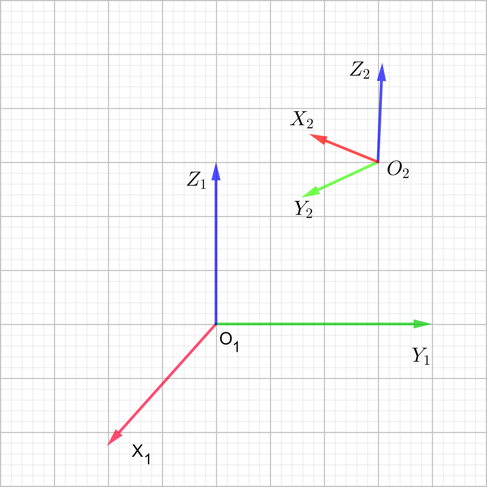
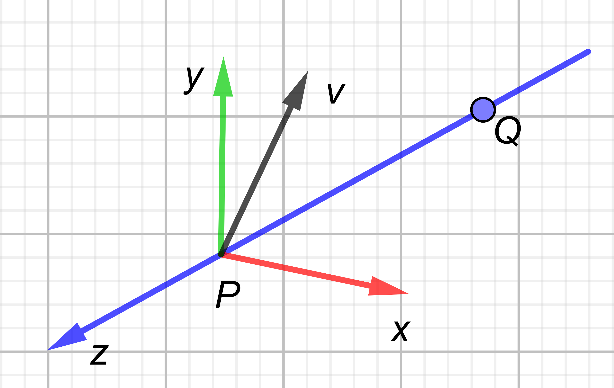
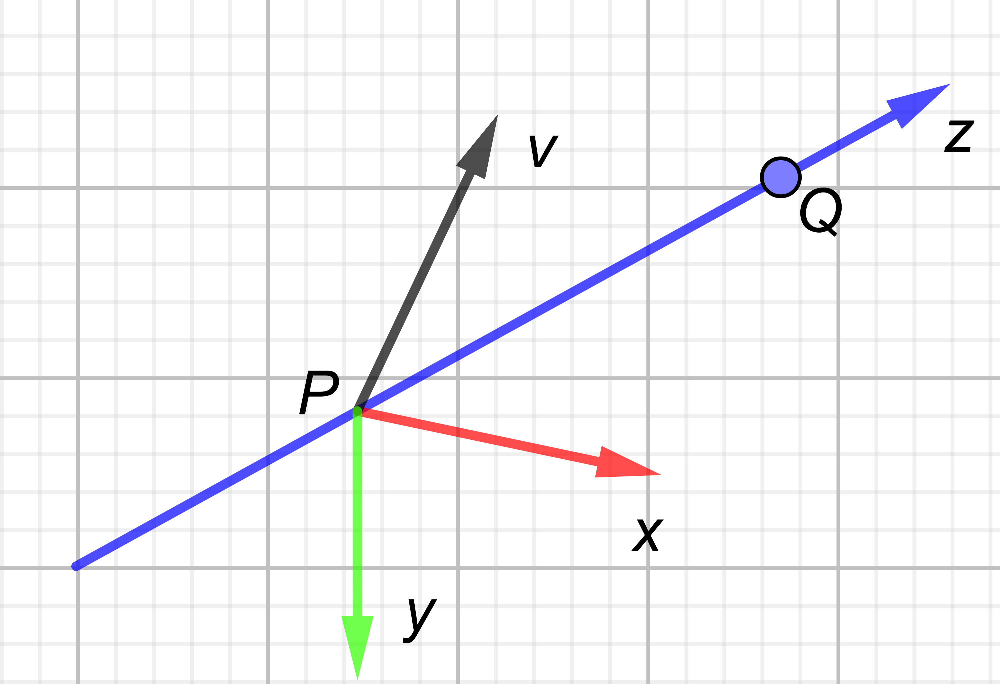
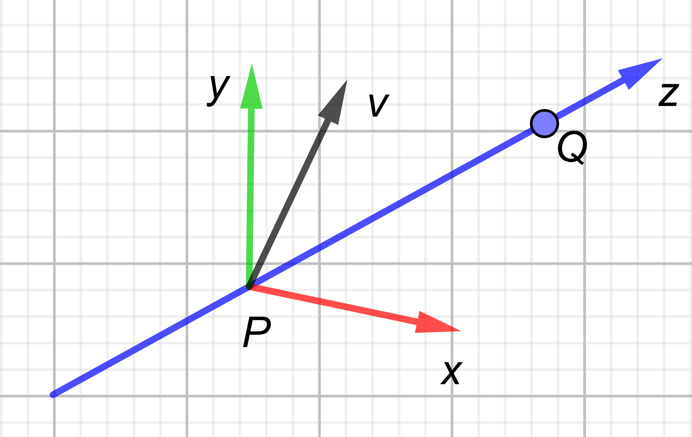
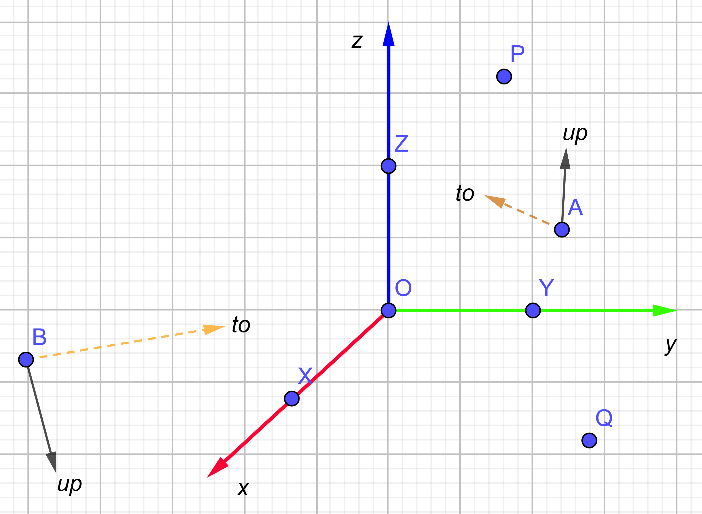
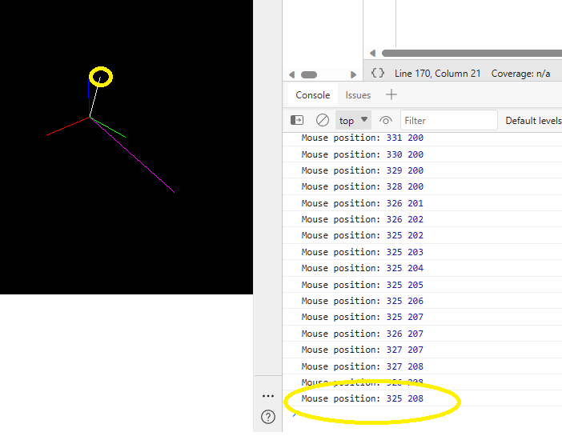

You may see function lookAt in proj_lookat_demo.html and glm_demo/src/main.cpp, but why can we calculate like that? I will explain it in the following part and show you an example.

Similar to projection matrix, lookat will also be affected by whether the camera coordinate system is positive or negative in the z-axis direction and right-hand or left-hand system. I believe you have encountered such confusion: you have seen different results of the lookat function from the Internet (or textbooks), which one is correct?\
The answer is that they are all correct, but they are calculated in different coordinate systems. That's why you should be very clear about the coordinate system you are using.\
Before we start to discuss lookAt, let me introduce how we can calculate rotation and translation matrix first.
<div align=center></div>
<div align=center>Figure 1</div>

Suppose we have a point in coordinate system $O_1$ has coordinates $(x_1,y_1,z_1)$, and its coordinates in coordinate system $O_2$ are $(x_2,y_2,z_2)$. Then the transformation relationship between these two coordinate systems is:

$$\begin{pmatrix} x_2 \\ 
y_2 \\ 
z_2 \end{pmatrix} = R_{21} \cdot \begin{pmatrix} x_1 \\ 
y_1 \\ 
z_1\end{pmatrix} + t_{21} \text{             (1)}$$

where $R_{21}$ is the rotation matrix and $t_{21}$ is the translation matrix. They will convert the point from coordinate system $O_1$ to coordinate system $O_2$.\
But there will be many different notations (because authors are different). For example, some people use $R_{12}$ or $R_{21}$ or $^2R_1$ or $_1^2R$ to represent this rotation matrix. So when we are trying to discuss rotation/translation matrix, we'd better place the formula (1) first. Under the definition of formula (1), we can easily get the rotation matrix:

$$R_{21} = \begin{pmatrix} X_2 \cdot X_1 & X_2 \cdot Y_1 & X_2 \cdot Z_1 \\ 
Y_2 \cdot X_1 & Y_2 \cdot Y_1 & Y_2 \cdot Z_1 \\
Z_2 \cdot X_1 & Z_2 \cdot Y_1 & Z_2 \cdot Z_1 \end{pmatrix}
\text{               (2)}$$

Which means that the three axes of coordinate system $O_2$ are dot product with the three axes of coordinate system $O_1$ respectively. The vectors involved in the dot product must be unit vectors. These vectors should all be described in the same coordinate system, such as all in the description of a coordinate system $O_3$ in space, or $O_1$ or $O_2$ one of them (then one of them will be (1, 0, 0) , (0, 1, 0), (0, 0, 1)).\
To calculate $t_{21}$, we can substitute $O_1=(0,0,0)$ into formula (1), then we can know that $t_{21}$ represents the coordinates of $O_1$ in coordinate system $O_2$.

Then let's calculate lookAt, suppose we stand on P, look at Q, and the up vector is v.

# 1. right-hand system, z negative direction (OpenGL default)
<div align=center></div>
<div align=center>Figure 2</div>

P, Q, v are all described in the world coordinate system (the $O_1$ in formula (1) ). And our goal is to establish a camera coordinate system at point P ( $O_2$ ), the direction of observation is point Q, and the upward vector is close to v (v may not be perpendicular to the line PQ). Since the established coordinate system is facing the negative direction of the z-axis, the vector PQ means -z, and then let v cross z (the opposite direction of PQ) to get x, and finally z cross x to get y:

$$\begin{cases}   z =normalize( P - Q) \\ 
x = normalize(v \times z) \\ 
y = z \times x \end{cases} 
\text{            (3)}$$

The xyz in formulation (3) are all described in the world coordinate system (the $O_1$ in formula (1) ). According to formula (2), we can calculate the rotation and translation matrix. Note that everyone is described in ( $O_1$ ) at this time, so we have $X_1=(1,0,0),Y_1=(0,1,0),Z_1=(0,0,1)$, so the rotation matrix is:

$$R_{21} = \begin{pmatrix} x_1 & x_2 & x_3 \\ 
y_1 & y_2 & y_3\\ 
z_1 & z_2 & z_3 \end{pmatrix}
\text{                 (4)}$$

The subscript $i$ of each letter in (4) represents the $i$ component of xyz in (3). Since point P is the origin of the camera coordinate system, so it is (0,0,0) in $O_2$, so we have:

$$\begin{pmatrix} 0 \\ 
0 \\ 
0 \end{pmatrix} = R_{21} \cdot P + t_{21} \Rightarrow t_{21} = - R_{21} \cdot P
\text{              (5)}$$

# 2. right-hand system, z positive direction (SFM/SLAM default)
There is no changes of P, Q and v, but you may notice the direction of y and z are changed.
<div align=center></div>
<div align=center>Figure 3</div>

$$\begin{cases}   z =normalize( Q- P)   \\ 
x = normalize(z \times v) \\
y = z \times x \end{cases}
\text{            (6)}$$

The calculation of $t_{21}$ is the same as the previous one (the formulation (5)).

# 3. left-hand system, z positive direction
<div align=center></div>
<div align=center>Figure 4</div>

$$\begin{cases}   z =normalize( Q- P)   \\ 
x = normalize(z \times v) \\
y = x \times z  \end{cases}
\text{       (7)}$$

The calculation of $t_{21}$ is the same as the previous one (the formulation (5)).

# 4. left-hand system, z negative direction
Please calculate yourself. 
You can refer proj_lookat_demo.html or glm_demo/src/main.cpp to see if your calculation is correct.

# 5. complete test which combine transformation matrix (lookAt) and projection matrix (perspective).
Let's take proj_lookat_demo.html as example. We still focus on the white point P. 
```javascript
var P = new THREE.Vector3( 10, 15, 20); 
addVector(scene, O, P, 0xffffff);// The line OP is white
```
The points OXYZPQ in Figure 5 correspond to the six points in the code. The points A and B represent two different observation positions, the dashed line is the direction, and the black vector represents the upward vector:
<div align=center></div>
<div align=center>Figure 5</div>

```javascript
var O = new THREE.Vector3( 0, 0, 0); 
var X = new THREE.Vector3( 10, 0, 0); 
var Y = new THREE.Vector3( 0, 10, 0); 
var Z = new THREE.Vector3( 0, 0, 10); 
var P = new THREE.Vector3( 10, 15, 20); // We focus on this point;
var Q = new THREE.Vector3( -10, 15, -20); 
```


When we are trying to set the rotation and translation matrix through the observation point, observation direction, and upward vector, we ***don't need*** to consider the direction of the camera z-axis. Because the direction of the camera z will be handled in the calculation of the rotation and translation matrix mentioned in the previous chapter. That is to say, exactly the same observation point, observation direction, and upward vector will correspond to different rotation and translation matrices under different camera z-axis settings.

In Figure (5), the point O is the origin of the world coordinate system. When setting point A, we need to consider:
1. You can set the points anywhere as you wish, such as point P and Q, you also can set a very large value  (but pay attention to the setting of the far clipping plane in the projection matrix, don't set it too far and be clipped).
2. Consider whether you want to see all the points completely. If so, then according to the setting of point P and Q, the position of point A needs to be farther than them such as (40, 50, 45), and the direction should be towards the area where P, Q are located.
3. Consider the position of the point you want to see to determine who the upward vector is, rather than setting it arbitrarily to (0, 1, 0). For example, according to the intuitive imagination, we stand and observe, then the upward vector should be similar to the direction of the z-axis, so it can be set to (0, 0, 1). If you want point Z to be on the left side of the screen and point X to be on the bottom, then the upward vector should be rotated clockwise by 90 degrees in the current observation direction, that is, the negative direction of the x-axis (-1, 0, 0).
4. One more example, when observing at point B and looking at point O, you expect X to be on the left side of the screen and Z to be on the bottom of the screen, then you should ***observe upside down***, so the upward vector is the negative direction of z (0, 0, -1).

You can try to update the code below:
```javascript
var from = new THREE.Vector3(40, 50, 45); // 摄像机位置 (camera position)
var to = new THREE.Vector3(2, 8, 5); // 摄像机观察方向 (camera direction)
var up = new THREE.Vector3(0, 0, 1); // 摄像机上方向 (camera up direction)
var transformMatrix = lookAt(from, to, up, zPositive, true); 
```

Then let's test right-hand system, z negative direction (OpenGL default).
set zPositive to false and rightHanded to true in both proj_lookat_demo.html and projection.py, you will see the following result from projection.py:
```python
[[311.9647579357983, 258.3833506387383], # O
[257.7611910721169, 281.24641837887566], # X
[357.5081004662229, 283.8552139581412],  # Y
[309.9355544720512, 209.79034716324463], # Z
[325.26556313595086, 208.07727746161126], # P, we focus on this point.
[418.3524013514285, 352.8025877763799]]  # Q
```
Then check the position of P when we run proj_lookat_demo.html
<div align=center></div>
<div align=center>Figure 6</div>

You can do the same test for the other three cases.
