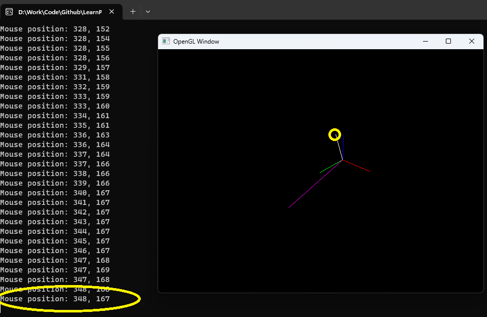

This is the OpenGL with glm demo to show how to setup/calculate lookAt/projection matrix.

# Setup
Since the goal of this demo is about projection matrix understanding, so I just use a simple CMake (please ignore the path which I hardcode in file) to build it.\
You can look at [Learn OpenGL](https://github.com/JoeyDeVries/LearnOpenGL) to learn more about how to setup a OpenGL project. Here I just show you how I build this simple demo in Windows.

1. Install vcpkg. You can learn more from this [page](https://vcpkg.io/en/getting-started.html), or clone it from [github](https://github.com/Microsoft/vcpkg)

2. Use vcpkg to install glfw3 and glm (my 32bit doesn't work, so I use 64bit, I don't know why)
```bash
vcpkg install glew:x64-windows
vcpkg install glfw3:x64-windows
vcpkg install glm:x64-windows
```
3. Use CMake to build it
```bash
cd glm_demo
mkdir build
cd build
cmake .. -DCMAKE_TOOLCHAIN_FILE=YOUR_PATH_OF_vcpkg/vcpkg/scripts/buildsystems/vcpkg.cmake
```
4. Open glm_demo.sln and build it

# Usage
Similar to proj_lookat_demo.html, this demo includes a complete test of lookAt and projection matrix. You can setup camera pose and projection parameters in main.cpp. Calculate the projection matrix and lookAt matrix yourself and verify if all 2d points on the rendering window are on the correct position. Please read [OpenGL_Projection.md](https://github.com/bitlw/LearnProjMatrix/blob/main/doc/OpenGL_Projection.md) and [lookAt.md](https://github.com/bitlw/LearnProjMatrix/blob/main/doc/lookAt.md) for how to calculate projection matrix; or you can look at projection.py for reference. \
main.cpp contains many comments, I think you can understand which parameters you need to setup. Just a reminder here, when you are using html test you will set viewportThreeJS (in projection.py) to true, but in this demo you need to set it to false because we are using OpenGL to render.

Here is an example of how to verify.

As you can see in main.cpp, we create 6 points and 5 lines, now let's focus on the white lines (OP):
```cpp
glm::vec4 red(1.0f, 0.0f, 0.0f, 1.0f);
glm::vec4 green(0.0f, 1.0f, 0.0f, 1.0f);
glm::vec4 blue(0.0f, 0.0f, 1.0f, 1.0f);
glm::vec4 white(1.0f, 1.0f, 1.0f, 1.0f);
glm::vec4 pink(1.0f, 0.0f, 1.0f, 1.0f);

std::vector<GLfloat> O = {0.0f, 0.0f, 0.0f};
std::vector<GLfloat> X = {10.0f, 0.0f, 0.0f};
std::vector<GLfloat> Y = {0.0f, 10.0f, 0.0f};
std::vector<GLfloat> Z = {0.0f, 0.0f, 10.0f};
std::vector<GLfloat> P = {10.0f, 15.0f, 20.0f};
std::vector<GLfloat> Q = {-10.0f, 15.0f, -20.0f};
CreateLine(O, X, red, transformMatrix, projection, vertexProperties);
CreateLine(O, Y, green, transformMatrix, projection, vertexProperties);
CreateLine(O, Z, blue, transformMatrix, projection, vertexProperties);
CreateLine(O, P, white, transformMatrix, projection, vertexProperties); // we focus on this white line.
CreateLine(O, Q, pink, transformMatrix, projection, vertexProperties);
```
Let's test left-hand, z negative case. According to our setup in main.cpp, we can get the 2d projection of point P should be [349.60, 168.08], I list output from here:
```cpp
[
[362.89774206420174, 218.38335063873834],  // O
[417.10130892788305, 241.24641837887563],  // X
[317.3543995337771, 243.85521395814118],   // Y
[364.9269455279488, 169.79034716324463],   // Z
[349.5969368640491, 168.07727746161126],   // P 
[256.51009864857144, 312.8025877763799]    // Q
]
```
Then run main.cpp, you will get a window and move your mouse on the end point of white line (P), you can see the coordinate of mouse cursor is [348, 167] (please ignore the error from my hand), which is the same as we calculated.\

