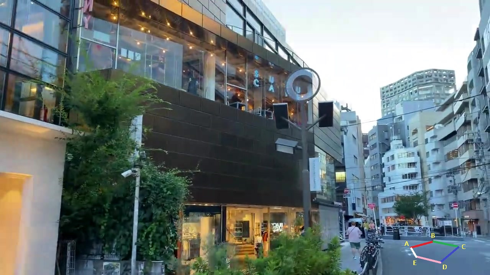
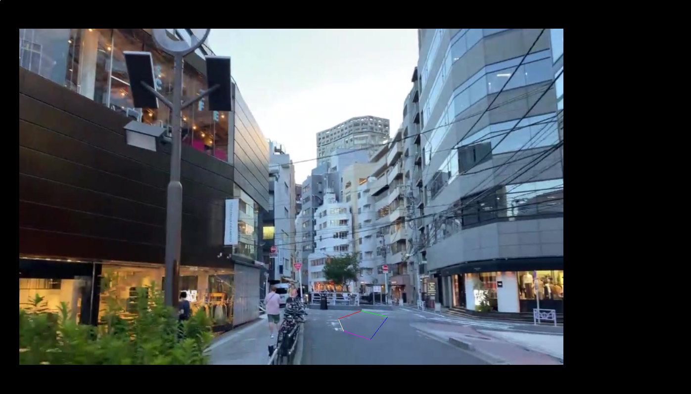

This is a demo to show how to render virtual objects in front of a real scene. 

# Usage
```bash
cd real_world_demo
python publish_files.py
```
Then simply to open real_world.html in browser and you will see the result, press "a" to see previous image and press "d" to see next image. \
I will provide all steps if you want to use your own data, and then analyze real_world.html \

# Preparation
## 1. Prepare a video, extract all frames. 
In this demo, I downloaded a video from youtube (https://www.youtube.com/watch?v=3PeHnWIJLNI) and extract frames (from about 19:10) using ffmpeg. You can see img_00xxx.jpg under textures folder (I just upload 6 images for demo). 
## 2. Reconstruction
I use colmap to reconstruct the scene. You can use any other software you like such as OpenMVG. Then prepare colmap_rst.json. \
Fill K, R, t and image names in colmap_rst.json. \
```json
"K": {
        "fx": 1033.0938,
        "fy": 1036.5565,
        "u0": 645.722,
        "v0": 363.978,
        "w": 1280, // this is the original image width and height,
        "h": 720   // I will resize when rendering to show you how resize impact the result.
    }
```
We are not able to fill "PlanePara" and "Points" right now, we will do it later. 
```json
"images": 
[
    "the name of image 1",
    "the name of image 2",
    ...
]
```

```json
"Pose": 
[
    [R00, R01, R02, R10, R11, R12, R20, R21, R22, t0, t1, t2], // camera pose for image 1
    [R00, R01, R02, R10, R11, R12, R20, R21, R22, t0, t1, t2], // camera pose for image 2
    ...
]
```
The camera pose here is used for converting a point under world coordinate to camera coordinate. Colmap will output camera pose for each image, you can use it directly (no need to do inverse). \
## 3. Extract a plane
You can choose a plane which you want to place virtual objects on. In this demo, I choose the floor. Then select some 3d points (after reconstruction you should be able to obtain 3d points cloud) on that plane and calculate plane parameters (a, b, c, d) \

$$
ax + by + cz + d = 0
$$

Now the plane parameters are actually under world coordinates, you can fill them in json file. \
```json
"PlanePara":
[
    [a, b, c, d],
    [a, b, c, d] // if you have second plane
]
```

## 4. Select points you want to render
Choose a frame, select points from the plane, now we just have 2d coordinates of them, then we should calculate 3d points for them according to the plane parameters and current camera pose. See Figure 1.
<div align=center></div>
<div align=center>Figure 1</div>

I use the first image (img_00128.jpg) and choose 5 points on the floor.  I also provide reconstruct3dFromPlane.py to calculate 3d points. \
```python
A_world = reconstructFromPlane(fx, fy, u0, v0, n_camera, d_camera, R, t, 1072, 646) # (1072, 646) is the 2d coordinate of A in img_00128.jpg
B_world = reconstructFromPlane(fx, fy, u0, v0, n_camera, d_camera, R, t, 1130, 630)
C_world = reconstructFromPlane(fx, fy, u0, v0, n_camera, d_camera, R, t, 1198, 644)
D_world = reconstructFromPlane(fx, fy, u0, v0, n_camera, d_camera, R, t, 1150, 687)
E_world = reconstructFromPlane(fx, fy, u0, v0, n_camera, d_camera, R, t, 1086, 670)
```
Then fill them in json file. \
```json
"Points":
[
    [-3.66772169,  1.21591909, 16.51000223], // the (x, y, z) of A 
    [-3.70140445,  1.212066,   24.87888067], // B
    [ -1.53029072,  1.15720468, 17.9924626], // C
    [-1.22782697,  1.15482665,  7.78641249], // D
    [-2.34565097,  1.18371707, 10.2001688]   // E
]
```
Once you finished all steps above, you can run real_world.html to see the result (please refer #Usage at the beginning of this doc), press "a" or "d" to navigate images. \

# Details of real_world.html
This is a demo code, as you can see I store each images as texture and create a scene for each texture. I think writing shader to replace the texture is a better way rather than create a new scene. But for learning purpose, it's OK to do like this, since here I just want to show you how to setup view/projection matrix correctly. \
***Please note that K,R,t are all obtained from colmap, as what I said before, this is right-hand, z positive case.*** \
```javascript
// the original image size is 1280 * 720, colmap worked on this image size, so the camera calibration 
// size is also 1280 * 720. As you can see below, I use different window size and view size which force 
// the image to be scaled. 
let windowWidth = 1400;
let windowHeight = 800;

// setup viewport of the rendering area, which is different from the window size
let viewStartX = 40; 
let viewStartY = 60;
let viewWidth = 1100; //  viewStartX + viewWidth <= windowWidth; So does viewHeight 
let viewHeight = 680; // different from calibration size, so the image will be scaled 
```

```javascript
// some code in function parseRawInfo

let calibrationWidth = rawInfo.K.w;
let calibrationHeight = rawInfo.K.h;
let viewWidth = windowConfig.viewWidth;
let viewHeight = windowConfig.viewHeight;
let near = windowConfig.near;
let far = windowConfig.far;

let ratioX = viewWidth / calibrationWidth; // scale the K if the view size is different from calibration size
let ratioY = viewHeight / calibrationHeight;
let fx = rawInfo.K.fx * ratioX;
let fy = rawInfo.K.fy * ratioY;
let u0 = rawInfo.K.u0 * ratioX;
let v0 = rawInfo.K.v0 * ratioY;

// right-hand, z positive case
let l = - u0 / fx * near;
let r = (viewWidth - u0) / fx * near;
let t = - v0 / fy * near;
let b = (viewHeight - v0) / fy * near;

let A =  - (far + near) / (near - far);
let B = 2 * (far * near) / (near - far);

info.projectionMatrix = new THREE.Matrix4();
info.projectionMatrix.set(2*near/(r-l), 0, - (r + l) / (r - l), 0,
                0, 2*near/(t - b), - (t + b) / (t - b), 0,
                0, 0, A, B,
                0, 0, 1, 0);
```
<div align=center></div>
<div align=center>Figure 2</div>
Figure 2 is one of the result, you can see black area on the left and right side, this is because I use different window size and view size. You can try to calculate 2d coordinates for ABCDE and press "F12" to check if your calculations are correct or not. \